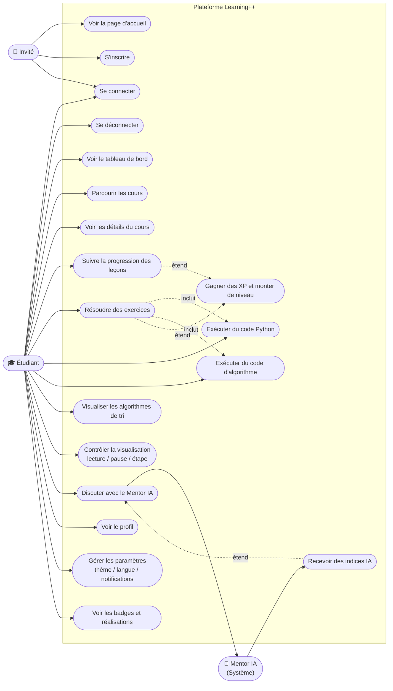

# Learning++ – Diagrammes UML

> Les diagrammes sont rédigés en [Mermaid](https://mermaid.js.org/) et s'affichent nativement sur GitHub.

---

## 1. Diagramme de cas d'utilisation

---

## 2. Diagramme de classes

```mermaid
classDiagram
    direction TB

    %% ── Modèle de données ───────────────────────────────────────────

    class Course {
        +string id
        +string title
        +string description
        +string category
        +string difficulty
        +number progress
        +number totalLessons
        +number completedLessons
        +string duration
        +number xpReward
        +string color
        +string icon
        +string[] tags
        +Chapter[] chapters
    }

    class Chapter {
        +string id
        +string title
        +Lesson[] lessons
    }

    class Lesson {
        +string id
        +string title
        +string type
        +string duration
        +boolean completed
        +boolean locked
        +number xp
    }

    class Exercise {
        +string id
        +string title
        +string difficulty
        +string category
        +boolean completed
        +number attempts
        +number xp
        +string description
        +string starterCode
        +string algorithmStarterCode
        +string solution
        +Array examples
        +string[] constraints
        +string hint
        +Array testCases
        +Array algorithmTestCases
    }

    class Badge {
        +string id
        +string name
        +string description
        +string icon
        +boolean earned
        +string earnedAt
        +string rarity
    }

    class ChatMessage {
        +string id
        +string role
        +string content
        +string timestamp
        +string type
    }

    class SortStep {
        +number[] array
        +number[] comparing
        +number[] swapping
        +number[] sorted
        +string description
    }

    %% ── Stores Zustand ──────────────────────────────────────────────

    class useAuthStore {
        +string|null token
        +boolean isAuthenticated
        +object|null authUser
        +setAuth(token, user) void
        +clearAuth() void
    }

    class useUserStore {
        +string id
        +string name
        +string email
        +string avatar
        +number xp
        +number level
        +number streak
        +number totalSolved
        +string rank
        +string joinedAt
        +string bio
        +string language
        +string theme
        +string[] completedExercises
        +object notifications
        +addXP(amount) void
        +incrementStreak() void
        +markExerciseSolved(id, xp) void
        +updateProfile(patch) void
        +updateNotifications(patch) void
        +updateTheme(theme) void
        +initUser(username, displayName, email) void
        +resetUser() void
    }

    class useEditorStore {
        +string code
        +string language
        +string output
        +boolean isRunning
        +string|null activeExerciseId
        +setCode(code) void
        +setLanguage(lang) void
        +setOutput(output) void
        +setRunning(bool) void
        +setActiveExercise(id) void
        +runCode() Promise~void~
    }

    class useVisualizationStore {
        +string algorithm
        +number[] array
        +SortStep[] steps
        +number currentStep
        +string state
        +number speed
        +number arraySize
        +setAlgorithm(algo) void
        +generateArray() void
        +setSpeed(speed) void
        +setArraySize(size) void
        +play() void
        +pause() void
        +reset() void
        +stepForward() void
        +stepBackward() void
        +skipToStart() void
        +skipToEnd() void
        +generateSteps() void
        +cleanup() void
    }

    class useMentorStore {
        +ChatMessage[] messages
        +boolean isTyping
        +sendMessage(content) Promise~void~
        +clearMessages() void
    }

    %% ── Bibliothèque / Utilitaires ──────────────────────────────────

    class PythonCompiler {
        +runPython(code, inputs) Promise~string~
    }

    class AlgoCompiler {
        +runAlgo(code, inputs) Promise~string~
    }

    class Utils {
        +cn(...inputs) string
        +formatXP(xp) string
        +getLevel(xp) number
        +getLevelProgress(xp) number
        +getDifficultyColor(difficulty) string
        +getDifficultyBg(difficulty) string
        +getRarityColor(rarity) string
        +getRarityGlow(rarity) string
    }

    %% ── Pages ───────────────────────────────────────────────────────

    class LandingPage { }
    class DashboardPage { }
    class CodeEditorPage { }
    class VisualizationPage { }
    class MentorPage { }
    class LearnPage { }
    class ProfilePage { }
    class SandboxPage { }
    class SignInPage { }
    class SignUpPage { }

    %% ── Relations ───────────────────────────────────────────────────

    Course "1" *-- "many" Chapter : contient
    Chapter "1" *-- "many" Lesson : contient
    useVisualizationStore "1" *-- "many" SortStep : génère

    useEditorStore --> PythonCompiler : utilise
    useEditorStore --> AlgoCompiler : utilise
    useEditorStore --> useUserStore : appelle markExerciseSolved

    useAuthStore --> useUserStore : déclenche initUser / resetUser

    DashboardPage --> useUserStore : lit
    DashboardPage --> useEditorStore : lit
    CodeEditorPage --> useEditorStore : lit / écrit
    CodeEditorPage --> useUserStore : lit
    VisualizationPage --> useVisualizationStore : lit / écrit
    MentorPage --> useMentorStore : lit / écrit
    LearnPage --> useUserStore : lit
    ProfilePage --> useUserStore : lit / écrit
    SandboxPage --> useEditorStore : lit / écrit
    SignInPage --> useAuthStore : écrit
    SignUpPage --> useAuthStore : écrit
```

---

## 3. Diagramme de paquets

