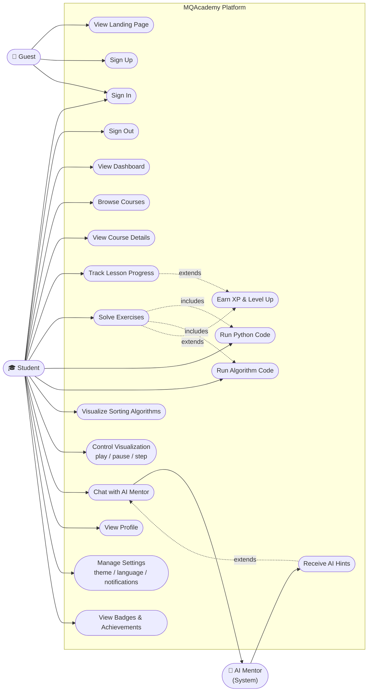
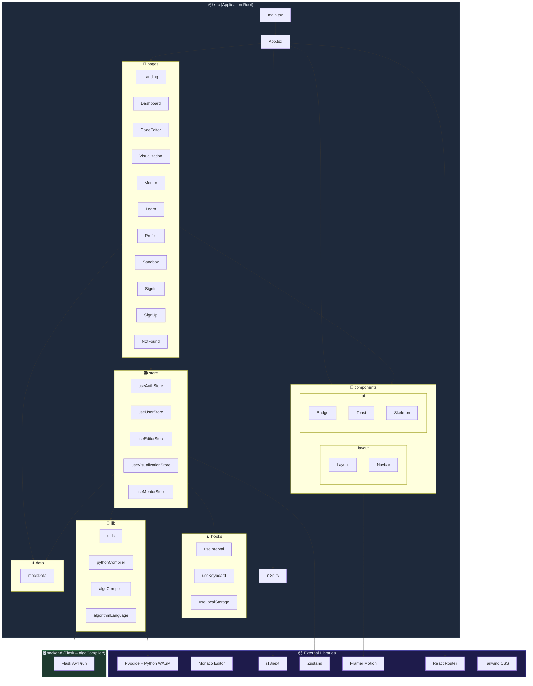

# MQAcademy – UML Diagrams

> Diagrams are written in [Mermaid](https://mermaid.js.org/) and render natively on GitHub.

---

## 1. Use Case Diagram

---

## 2. Class Diagram

---

## 3. Package Diagram

